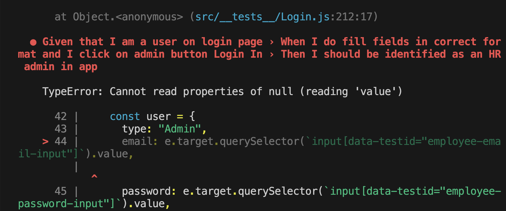
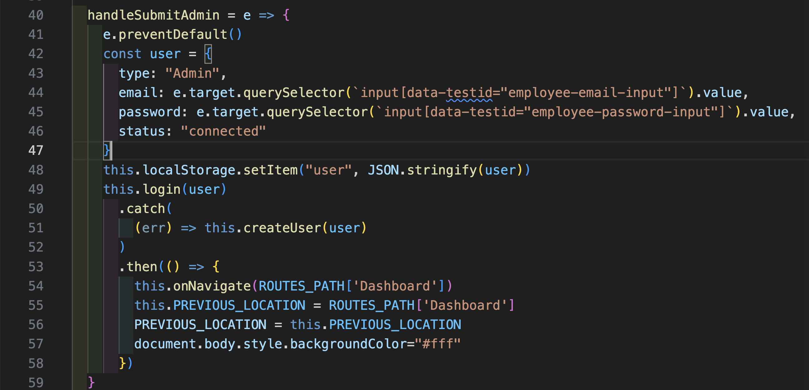
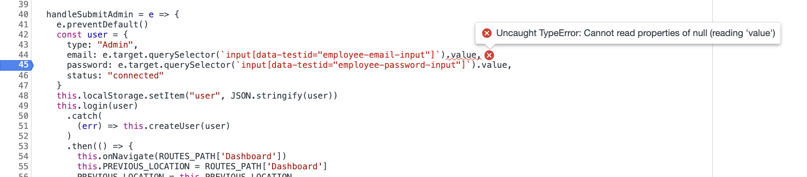
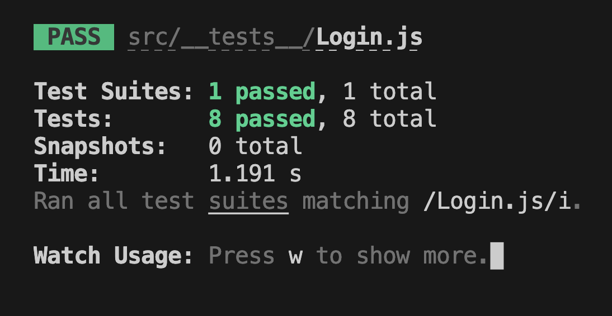
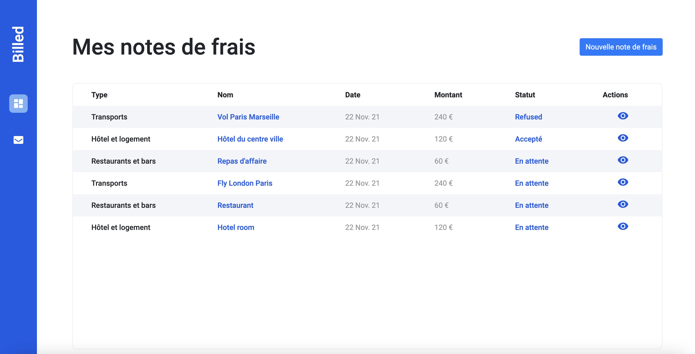
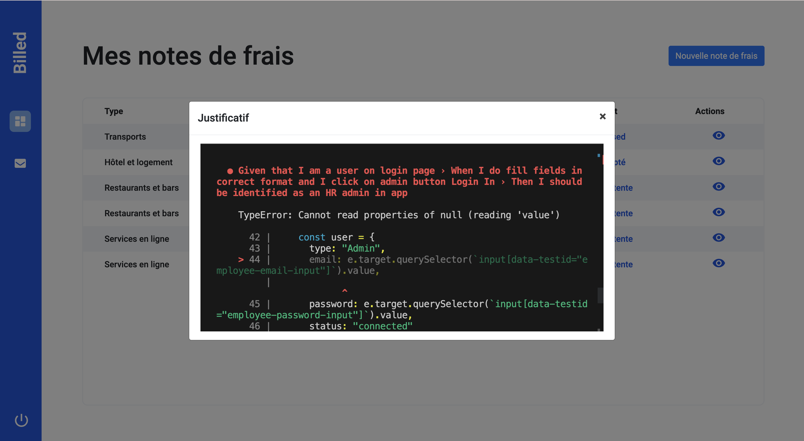
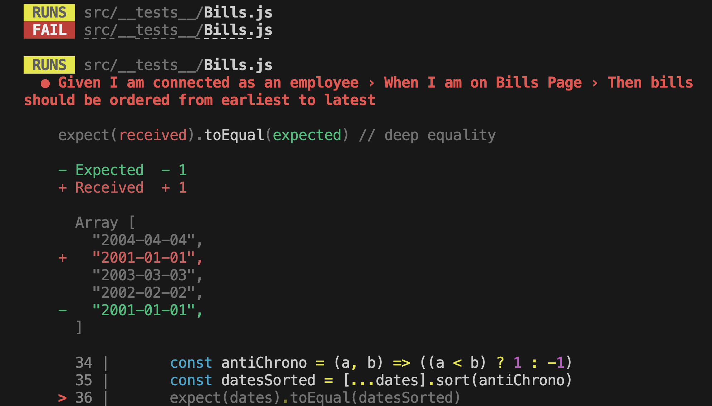
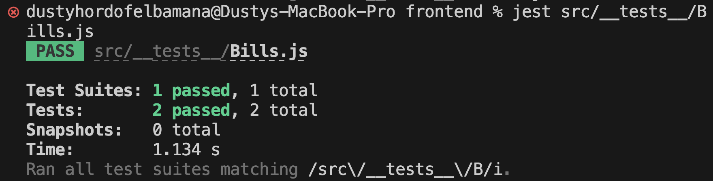

## 1. [Bug report] - Bills | Login 🔥

- Lors du lancement du test jest src/**tests**/Login.js,
  j'ai une erreur me disant

### 

- je localise l'erreur grace aux informations données
  `at HTMLFormElement.handleSubmitAdmin (src/containers/Login.js:44:81)`

### 

- j'essaie de me connecter en tant qu'Admin, mon anvigateur ne me renvoi aucune erreur
- je vais sur le debuggeur de Google Chrome , je mets des points d'arrets au niveau de l'erreur!
  - j'ai le même message `Uncaught TypeError: Cannot read properties of null (reading 'value')`

### 

- je recherche la [vue (LoginUI)](frontend/src/views/LoginUI.js) du formulaire Administrateur pour voir les noms des sélecteurs des inputs sélectionnés pour les comparer avec ceux utilisés. Je remarque que j'ai `admin-email-input` et `admin-password-input` au lieu de `employee-email-input`et`employee-password-input`
- je fais les changements et resfait le test. Tout passe et je me connecte en tant qu'administrateur!
  ### 
  ### 

## 3. [Bug report] - Bills | High| Image 🔥

- Le deuxième bug concerne l’affichage des images, les images des notes de frais ne s’affichent lorsqu’on clique dessus. Il n’y a pas de test à ce niveau communiquant une information précise sur l’origine de l’erreur. Il s’agit ici de définir les types de format qui sont acceptés. Pour trouver le fichier concerné grâce au débuggeur, j’inspecte l’input élément qui se situe dans le formulaire de création de la note de frais, je copie l’attribue de données `data-testid="file"` contenues dans l’input pour trouver le fichier concerné `NewBill` et la fonction `handleChangeFile` qui gère le changement de fichier. J’ajoute les différents formats qui doivent être accepté et j’ajoute le script autorisant les différents formats.

```js
const validExtensions = ["image/jpg", "image/jpeg", "image/png"]; //liste des types de fichiers acceptés
// If the file type is included in the list of allowed file types,
// create a new bill with the file and email using the bills store's create method
if (validExtensions.includes(file.type)) {
  this.store
    .bills()
    .create({
      data: formData,
      headers: { noContentType: true },
    })
    .then(({ fileUrl, key }) => {
      console.log(fileUrl);
      this.billId = key;
      this.fileUrl = fileUrl;
      this.fileName = fileName;
    })
    .catch((error) => console.error(error));
} else {
  // If the file type is not allowed, show an alert and reset the file input's value
  alert("Le fichier doit être une image avec une extension JPG, JPEG ou PNG.");
  e.target.value = "";
}
```

- lancement du test

### 

### 4. [Bug report] - Bills | High|Sorting 🔥

- Le troisième bug concernent le tri des factures par ordre décroissant. On doit ici faire passer le test au vert. Au lancement du test

### 

Le test ne passe pas parce que les notes de frais ne sont pas triées par dans le bon ordre. Je vais donc au niveau de toutes les factures, j’inspecte la table pour localiser le fichier concerné, je copie la classe `class="table table-striped"`
et j’effectue une recherche pour localiser le fichier ou se trouve cette classe, il se trouve dans `BillUI` . Je mets en place des break-points pour localiser la fonction qui gère la vue, c’est la fonction `modal()` qui gère la vue et qui a une fonction `rows` qui reçoit des données sans les filtrer.

```js
const rows = (data) => {
  return data && data.length ? data.map((bill) => row(bill)).join("") : "";
};
```

On filtre les données de les afficher

```js
const rows = (data) => {
  return data && data.length
    ? data
        .sort((a, b) => new Date(b.date) - new Date(a.date)) //TODO 4 Sort bills by date
        .map((bill) =>
          row({
            ...bill,
            date: bill.date,
          })
        )
        .join("")
    : "";
};
```

- On relance le test pour voir si ça passe , tout passe !

### 

### 5. [Bug Hunt] - Dashboard 🔥

- Le quatrième test concerne l’affichage des notes de frais en fonction « des notes de frais ».

<!-- - je vais au niveau de Dashboard pour trouver la function qui gère l'affichage des facture ainsi que le click. -->

- Je vais sur le débugger et je mets les différents breakPoints pour
  voir à quel moment chaque élément s'affichent.
  - tout s'affiche à partir de la function `handleEditTicket`,elle va gérée des évennement comme l'acceptation ou le refus des factures
  - `handleShowTickets` va gérer les icons , filtrer les factures par status et le comportment au niveau des clicks de chaque facture.

```js
bills.forEach((bill) => {
  $(`#open-bill${bill.id}`).click((e) => this.handleEditTicket(e, bill, bills));
});
```

- `handleShowTickets` Ce gère l'affichage et l'interaction avec des tickets ou des factures dans un contexte où différents types de tickets sont regroupés par statut.

```js
//[Bug hunt] - Dashboard | High 🔥
bills.forEach((bill) => {
  $(`#open-bill${bill.id}`).off("click"); //TODO 5 - On remove l'eventListener existant avant d'en ajouter un
  $(`#open-bill${bill.id}`).on("click", (e) => {
    this.handleEditTicket(e, bill, bills);
  });
});
```

En utilisant la méthode .off() pour supprimer les gestionnaires de clic existants avant d'en ajouter de nouveaux, vous évitez tout risque de doublons ou de comportements inattendus liés aux événements.
